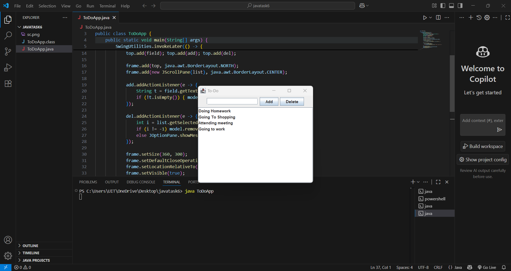

# java-gui-taskmanager

## Description
This project is a simple To-Do List desktop application created using Java Swing.  
It enables users to add and remove tasks through a clean graphical user interface.  
This is an excellent project for beginners to understand Java Swing components like JFrame, JButton, JTextField, and event-driven programming.

## Screenshot


## How to Run
1. Clone the repository.  
2. Open in IntelliJ IDEA or Eclipse.  
3. Run the `ToDoApp.java` file.  
4. Or compile and run using terminal:
 ``` bash
     javac ToDoApp.java
     java ToDoApp
```

## Author
Hemasripatkuri4

---

Thanks for visiting this Java Swing To-Do List project!  
Feel free to reach out if you have any questions or feedback. 🙂


